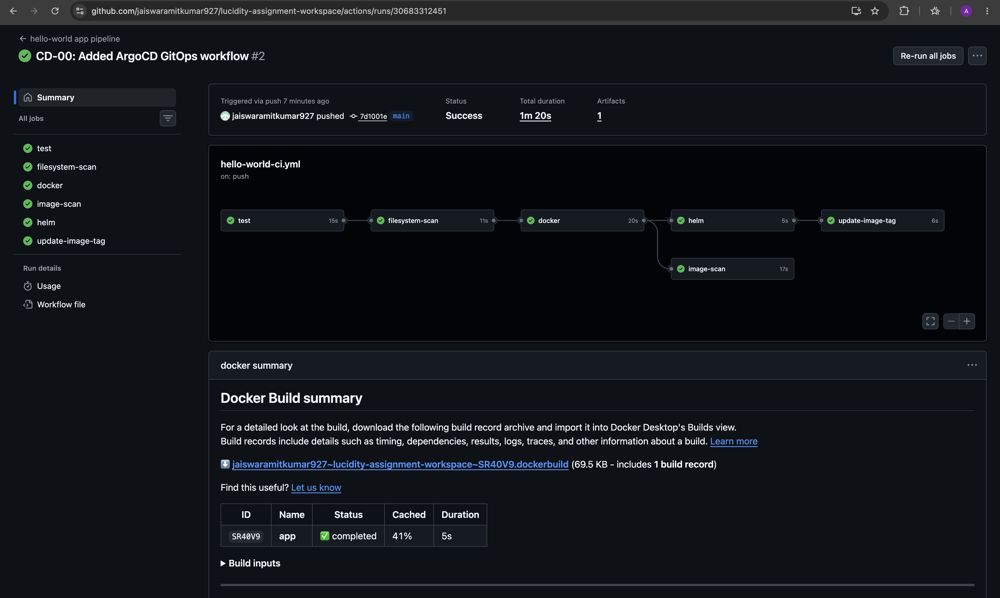
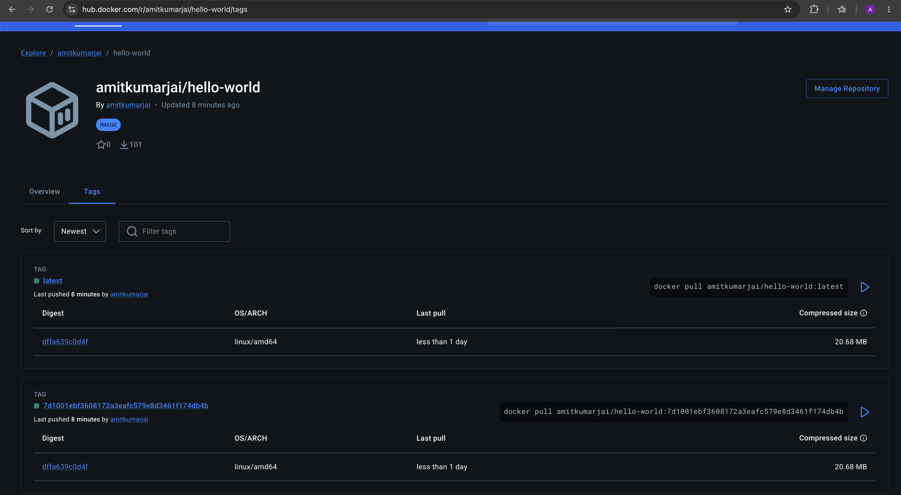
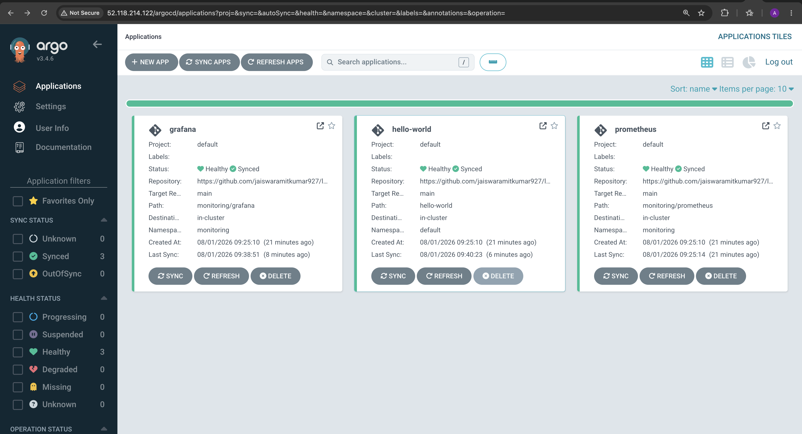
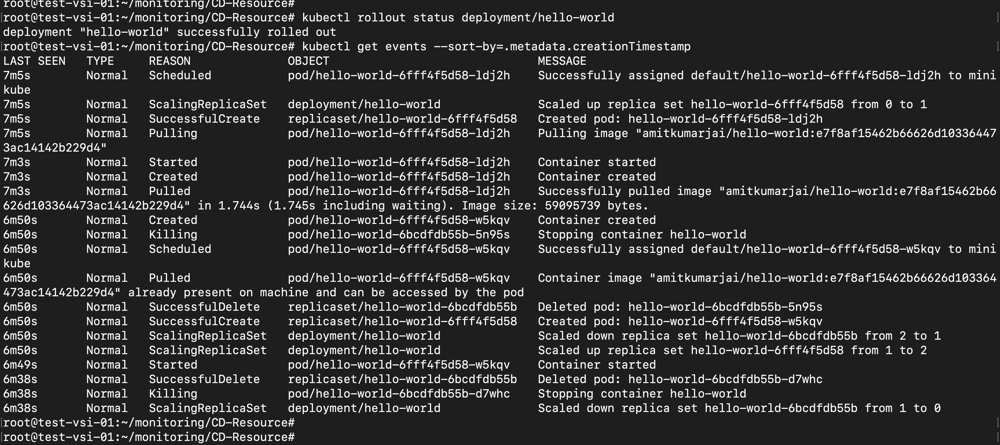

# Lucidity Assignment Workspace

This repository contains Terraform code for provisioning AWS networking and Amazon EKS infrastructure, along with application, Helm, and monitoring assets.

## Repository structure

- [`terraform/`](terraform) - Terraform modules and environment stacks.
- [`terraform/environments/dev/`](terraform/environments/dev) - Development environment with VPC, IAM, EKS, security groups, route tables, and EKS access entries.
- [`terraform/environments/prod/`](terraform/environments/prod) - Production environment with VPC and EKS resources.
- [`helm/`](helm) - Helm-related assets.
- [`app/`](app) and [`hello-world/`](hello-world) - Application source directories.
- [`monitoring/`](monitoring) - Monitoring manifests and charts.

## Terraform layout

The development stack in [`terraform/environments/dev/main.tf`](terraform/environments/dev/main.tf) provisions:

- VPC and subnets through [`module "vpc"`](terraform/environments/dev/main.tf:1)
- Route tables through [`module "route_tables"`](terraform/environments/dev/main.tf:29)
- Network ACLs through [`module "network_acl"`](terraform/environments/dev/main.tf:59)
- Security groups through [`module "security_groups"`](terraform/environments/dev/main.tf:86)
- IAM roles through [`module "iam"`](terraform/environments/dev/main.tf:103)
- EKS access entries through [`module "eks_access"`](terraform/environments/dev/main.tf:110)
- EKS cluster and managed node groups through [`module "eks"`](terraform/environments/dev/main.tf:132)

The production stack in [`terraform/environments/prod/main.tf`](terraform/environments/prod/main.tf:1) currently provisions VPC and EKS only.

## Prerequisites

Install and configure the following:

- Terraform
- AWS CLI v2
- [`kubectl`](https://kubernetes.io/docs/tasks/tools/)
- An AWS IAM identity with permission to manage IAM, VPC, EKS, S3 backend state, and DynamoDB state locking

Configure AWS credentials before running Terraform:

```bash
aws configure
aws sts get-caller-identity
```

## Terraform remote state

Both environments use an S3 backend with DynamoDB locking:

- Dev backend: [`terraform/environments/dev/backend.tf`](terraform/environments/dev/backend.tf:1)
- Prod backend: [`terraform/environments/prod/backend.tf`](terraform/environments/prod/backend.tf:1)

Configured backend resources:

- S3 bucket: `lucidity-prod-terraform-state`
- DynamoDB table: `terraform-lock`
- Region: `us-east-1`

### Terraform bootstrap steps

Instead of creating the backend resources manually, use the bootstrap stack in [`terraform-bootstrap/`](terraform-bootstrap). This stack provisions:

- A KMS key through [`module "kms"`](terraform-bootstrap/main.tf:1)
- An S3 state bucket through [`module "state_bucket"`](terraform-bootstrap/main.tf:10)
- A DynamoDB lock table through [`module "dynamodb"`](terraform-bootstrap/main.tf:21)
- A Terraform deployment IAM role through [`module "terraform_role"`](terraform-bootstrap/main.tf:30)

Bootstrap defaults are defined in [`terraform-bootstrap/terraform.tfvars`](terraform-bootstrap/terraform.tfvars:1):

- State bucket: `lucidity-prod-terraform-state`
- Lock table: `terraform-lock`
- Region: `us-east-1`
- KMS alias: `terraform-state-key`
- IAM role: `terraform-deployment-role`

### 1. Review the bootstrap configuration

Check the provider and variables in [`terraform-bootstrap/providers.tf`](terraform-bootstrap/providers.tf:1), [`terraform-bootstrap/variables.tf`](terraform-bootstrap/variables.tf:1), and [`terraform-bootstrap/terraform.tfvars`](terraform-bootstrap/terraform.tfvars:1).

### 2. Initialize the bootstrap stack

```bash
cd terraform-bootstrap
terraform init
terraform fmt -recursive
terraform validate
```

### 3. Review the execution plan

```bash
terraform plan -var-file=terraform.tfvars
```

### 4. Apply the bootstrap stack

```bash
terraform apply -var-file=terraform.tfvars
```

### 5. Confirm the backend resources were created

The bootstrap modules create the S3 bucket, KMS encryption, public access block, DynamoDB lock table, and IAM role in:

- [`terraform-bootstrap/modules/s3-state-bucket/main.tf`](terraform-bootstrap/modules/s3-state-bucket/main.tf:1)
- [`terraform-bootstrap/modules/kms-key/main.tf`](terraform-bootstrap/modules/kms-key/main.tf:1)
- [`terraform-bootstrap/modules/dynamodb-lock/main.tf`](terraform-bootstrap/modules/dynamodb-lock/main.tf:1)
- [`terraform-bootstrap/modules/iam-role/main.tf`](terraform-bootstrap/modules/iam-role/main.tf:1)

You can verify the created resources with:

```bash
aws s3api head-bucket --bucket lucidity-prod-terraform-state
aws dynamodb describe-table --table-name terraform-lock --region us-east-1
aws kms list-aliases --region us-east-1
aws iam get-role --role-name terraform-deployment-role
```

### 6. Use the provisioned backend for environment deployments

After the bootstrap stack succeeds, run [`terraform init`](terraform/environments/dev/backend.tf:1) in [`terraform/environments/dev/`](terraform/environments/dev) or [`terraform/environments/prod/`](terraform/environments/prod).

## Deploying with Terraform

### Development

```bash
cd terraform/environments/dev
terraform init
terraform fmt -recursive
terraform validate
terraform plan -var-file=terraform.tfvars
terraform apply -var-file=terraform.tfvars
```

### Production

```bash
cd terraform/environments/prod
terraform init
terraform fmt -recursive
terraform validate
terraform plan -var-file=terraform.tfvars
terraform apply -var-file=terraform.tfvars
```

## IAM roles created by Terraform

The IAM module creates roles from the `roles` map defined in [`terraform/environments/dev/terraform.tfvars`](terraform/environments/dev/terraform.tfvars:76) using [`aws_iam_role.this`](terraform/modules/iam/main.tf:1) and attaches AWS managed policies using [`aws_iam_role_policy_attachment.this`](terraform/modules/iam/main.tf:11).

Current development roles:

- `devops`
- `developers`
- `readonly`
- `jenkins`

The role ARNs are exposed through [`output "role_arns"`](terraform/modules/iam/outputs.tf:1) and are consumed by [`module "eks_access"`](terraform/environments/dev/main.tf:110).

## EKS cluster access using IAM and kubeconfig

EKS access entries are created by [`aws_eks_access_entry.this`](terraform/modules/eks-access/main.tf:1) and policy associations are created by [`aws_eks_access_policy_association.this`](terraform/modules/eks-access/main.tf:12). These entries authorize IAM principals to access the cluster.

### Get the cluster name

The EKS module exports the cluster name through [`output "cluster_name"`](terraform/modules/eks/outputs.tf:1).

Example:

```bash
aws eks list-clusters --region us-east-1
```

### Option 1: direct IAM user access with kubeconfig

If an IAM user is the identity running the AWS CLI and that IAM user has been granted EKS access, generate kubeconfig with:

```bash
aws eks update-kubeconfig \
  --region us-east-1 \
  --name dev-eks
```

Verify access:

```bash
kubectl config current-context
kubectl get nodes
kubectl get ns
```

### Option 2: assume an IAM role and generate kubeconfig

If cluster access is granted to an IAM role such as `devops`, assume the role first or use the role directly in kubeconfig generation:

```bash
aws eks update-kubeconfig \
  --region us-east-1 \
  --name dev-eks \
  --role-arn arn:aws:iam::<account-id>:role/devops
```

Then validate:

```bash
kubectl get nodes
kubectl auth can-i get pods --all-namespaces
```

### Inspect configured EKS access entries

```bash
aws eks list-access-entries \
  --cluster-name dev-eks \
  --region us-east-1
```

## Jenkins agent access from EC2 IAM role

The `jenkins` IAM role is declared in [`terraform/environments/dev/terraform.tfvars`](terraform/environments/dev/terraform.tfvars:103). To use this for deployments from a Jenkins agent running on EC2:

1. Create or use an EC2 instance profile that can assume or directly uses the `jenkins` role.
2. Attach the instance profile to the Jenkins agent EC2 instance.
3. Ensure the `jenkins` role is included in EKS access entries so it can authenticate to the cluster.
4. On the Jenkins agent, confirm credentials are coming from the instance metadata service:

```bash
aws sts get-caller-identity
```

5. Generate kubeconfig on the Jenkins agent:

```bash
aws eks update-kubeconfig \
  --region us-east-1 \
  --name dev-eks \
  --role-arn arn:aws:iam::<account-id>:role/jenkins
```

6. Use [`kubectl`](https://kubernetes.io/docs/tasks/tools/) or Helm in the pipeline for deployments:

```bash
kubectl get nodes
helm list -A
```

If the EC2 instance profile is already the same IAM role authorized in EKS, the `--role-arn` argument can be omitted.

## Manual deployment steps for the Hello World stack

The application chart is defined in [`hello-world/Chart.yaml`](hello-world/Chart.yaml:1) and its default deployment settings are in [`hello-world/values.yaml`](hello-world/values.yaml:1).

### 1. Connect to the target EKS cluster

Use the kubeconfig flow described earlier in this README and confirm cluster access:

```bash
kubectl get nodes
kubectl get ns
```

### 2. Verify Helm is installed

```bash
helm version
```

### 3. Create or confirm the target namespace

The default service target in the monitoring values points to `hello-world.default.svc.cluster.local`, so the app should be deployed into the `default` namespace unless you also update [`monitoring/prom_values.yaml`](monitoring/prom_values.yaml:1).

```bash
kubectl get namespace default || kubectl create namespace default
```

### 4. Review the Hello World chart values

Important defaults from [`hello-world/values.yaml`](hello-world/values.yaml:25):

- Service type: `ClusterIP`
- Service port: `8080`
- Image tag: `e7f8af15462b66626d103364473ac14142b229d4`
- Replicas: `2`
- Application access should be routed through the NGINX ingress endpoint `http://52.118.214.122/`

### 5. Deploy the Hello World chart

```bash
helm upgrade --install hello-world ./hello-world \
  --namespace default \
  -f ./hello-world/values.yaml
```

### 6. Verify the application deployment

```bash
kubectl get deploy,po,svc -n default
kubectl rollout status deployment/hello-world -n default
kubectl describe svc hello-world -n default
```

### 7. Test application access through NGINX Ingress

Use the shared ingress endpoint `http://52.118.214.122/` to access the Hello World application.

```bash
kubectl get svc,ingress -n default
curl http://52.118.214.122/
curl http://52.118.214.122/metrics
```

## Manual deployment steps for the monitoring stack

The monitoring stack uses the vendored Prometheus chart in [`monitoring/prometheus/Chart.yaml`](monitoring/prometheus/Chart.yaml:1) and the Grafana chart in [`monitoring/grafana/Chart.yaml`](monitoring/grafana/Chart.yaml:1), with overrides in [`monitoring/prom_values.yaml`](monitoring/prom_values.yaml:1) and [`monitoring/graf_values.yaml`](monitoring/graf_values.yaml:1).

### 1. Create the monitoring namespace

```bash
kubectl get namespace monitoring || kubectl create namespace monitoring
```

### 2. Deploy Prometheus

The Prometheus override file configures:

- Cluster-internal service exposure
- `2d` retention
- Static scrape target: `hello-world.default.svc.cluster.local:8080`
- `kube-state-metrics` enabled

Deploy it with:

```bash
helm upgrade --install prometheus ./monitoring/prometheus \
  --namespace monitoring \
  -f ./monitoring/prom_values.yaml
```

Verify the release:

```bash
kubectl get pods,svc -n monitoring
kubectl rollout status deployment/prometheus-server -n monitoring
```

### 3. Confirm Prometheus can scrape the Hello World app

Open Prometheus locally with port-forwarding:

```bash
kubectl port-forward svc/prometheus-server 9090:80 -n monitoring
```

Then open `http://127.0.0.1:9090` and check the target status, or query from the CLI:

```bash
kubectl get svc -n monitoring
curl http://127.0.0.1:9090/api/v1/targets
```

### 4. Deploy Grafana

The Grafana override file configures:

- `ClusterIP` service in [`monitoring/graf_values.yaml`](monitoring/graf_values.yaml:11)
- Admin credentials from the existing secret in [`monitoring/graf_values.yaml`](monitoring/graf_values.yaml:17)
- Prometheus datasource pointing to `http://prometheus-server.monitoring.svc.cluster.local`
- Preloaded dashboards from [`monitoring/grafana/dashboards/`](monitoring/grafana/dashboards)
- Subpath access behind NGINX ingress in [`monitoring/graf_values.yaml`](monitoring/graf_values.yaml:1)

Deploy it with:

```bash
helm upgrade --install grafana ./monitoring/grafana \
  --namespace monitoring \
  -f ./monitoring/graf_values.yaml
```

Verify the release:

```bash
kubectl get pods,svc -n monitoring
kubectl rollout status deployment/grafana -n monitoring
```

### 5. Access Grafana through NGINX Ingress

Use the shared ingress endpoint `http://52.118.214.122/` and access Grafana on the `/grafana/` path.

```bash
kubectl get svc,ingress -n monitoring
```

Open `http://52.118.214.122/grafana/` and log in using the credentials stored in the existing Kubernetes secret referenced by [`monitoring/graf_values.yaml`](monitoring/graf_values.yaml:17).

### 6. Validate dashboards and metrics

After login to Grafana:

1. Confirm the Prometheus datasource is healthy.
2. Open the imported `hello-world` dashboard.
3. Open the Kubernetes dashboards shipped from [`monitoring/grafana/dashboards/hello-world.json`](monitoring/grafana/dashboards/hello-world.json), [`monitoring/grafana/dashboards/kubernetes-global.json`](monitoring/grafana/dashboards/kubernetes-global.json), and [`monitoring/grafana/dashboards/kubernetes-cluster.json`](monitoring/grafana/dashboards/kubernetes-cluster.json).
4. Confirm application and cluster metrics are visible.

### 7. Useful operational commands

```bash
helm list -A
helm status hello-world -n default
helm status prometheus -n monitoring
helm status grafana -n monitoring
kubectl get all -n monitoring
kubectl logs deployment/prometheus-server -n monitoring
kubectl logs deployment/grafana -n monitoring
```

### CI/CD architecture diagram

The following architecture describes the end-to-end GitOps flow implemented by this repository:

```text
Developer
    │
    │ git push
    ▼
GitHub Repository
    │
    ▼
GitHub Actions (CI)
    ├── Test
    ├── Lint
    ├── Trivy Scan
    ├── Build Docker Image
    ├── Push Docker Image
    ├── Update Helm values.yaml
    └── Commit values.yaml
             │
             ▼
Git Repository (updated Helm chart)
             │
             ▼
Argo CD (Auto Sync)
             │
             ▼
Helm Upgrade
             │
             ▼
Kubernetes Cluster
```

This flow maps directly to [`.github/workflows/hello-world-ci.yml`](.github/workflows/hello-world-ci.yml:1), the Argo CD Application manifests in [`gitOps-CD/CD-Resource/`](gitOps-CD/CD-Resource), and the live deployment on EKS.

## CD with Argo CD

The CD setup is stored in [`gitOps-CD/`](gitOps-CD) and applies Helm charts from this repository into the EKS cluster using Argo CD Applications.

## CI with GitHub Actions

The CI workflow is implemented in [`hello-world app pipeline`](.github/workflows/hello-world-ci.yml:1) and gives end users a clear path to understand how source code changes move from GitHub to Docker Hub and then into GitOps-driven deployment.

### CI repository walkthrough

The main CI assets are:

- Application source in [`app/`](app)
- Container build definition in [`app/Dockerfile`](app/Dockerfile)
- Helm chart in [`hello-world/`](hello-world)
- Monitoring charts in [`monitoring/prometheus/`](monitoring/prometheus) and [`monitoring/grafana/`](monitoring/grafana)
- GitHub Actions workflow in [`.github/workflows/hello-world-ci.yml`](.github/workflows/hello-world-ci.yml:1)

### CI workflow stages

The pipeline runs these jobs from [`.github/workflows/hello-world-ci.yml`](.github/workflows/hello-world-ci.yml:18):

1. [`test`](.github/workflows/hello-world-ci.yml:24) validates the Python app.
2. [`filesystem-scan`](.github/workflows/hello-world-ci.yml:62) runs a Trivy filesystem scan.
3. [`docker`](.github/workflows/hello-world-ci.yml:82) builds and pushes the Docker image.
4. [`image-scan`](.github/workflows/hello-world-ci.yml:124) scans the pushed image.
5. [`helm`](.github/workflows/hello-world-ci.yml:141) lints and renders the Helm charts.
6. [`update-image-tag`](.github/workflows/hello-world-ci.yml:175) updates [`hello-world/values.yaml`](hello-world/values.yaml:17) with the new image tag on `main`.

### CI images

#### GitHub Actions workflow run



This image should show the workflow graph for the jobs defined in [`.github/workflows/hello-world-ci.yml`](.github/workflows/hello-world-ci.yml:24).

#### Docker Hub image tags



This image should show the pushed tags that correspond to the image publishing step in [`docker`](.github/workflows/hello-world-ci.yml:103).

### CD repository walkthrough

The main CD assets are:

- Argo CD Helm values in [`gitOps-CD/values.yaml`](gitOps-CD/values.yaml:1)
- Argo CD ingress in [`gitOps-CD/argo-cd-ingress.yaml`](gitOps-CD/argo-cd-ingress.yaml:1)
- Hello World Argo CD app in [`gitOps-CD/CD-Resource/hello-world-CD.yaml`](gitOps-CD/CD-Resource/hello-world-CD.yaml:1)
- Prometheus Argo CD app in [`gitOps-CD/CD-Resource/prometheus.yaml`](gitOps-CD/CD-Resource/prometheus.yaml:1)
- Grafana Argo CD app in [`gitOps-CD/CD-Resource/grafana-cd.yaml`](gitOps-CD/CD-Resource/grafana-cd.yaml:1)
- Hello World ingress in [`k8s-ingress.yml`](k8s-ingress.yml:1)
- Grafana ingress in [`grafana-ingress.yml`](grafana-ingress.yml:1)

### How CD works in this repository

1. GitHub Actions updates [`hello-world/values.yaml`](hello-world/values.yaml:17) with the latest image SHA.
2. Argo CD watches the `main` branch of this repository using the [`repoURL`](gitOps-CD/CD-Resource/hello-world-CD.yaml:11) configured in each Application.
3. Argo CD syncs the Helm chart paths for Hello World, Prometheus, and Grafana.
4. NGINX ingress exposes the deployed services at:
   - Hello World: [`http://52.118.214.122/`](http://52.118.214.122/)
   - Grafana: [`http://52.118.214.122/grafana/`](http://52.118.214.122/grafana/)
   - Argo CD: [`http://52.118.214.122/argocd`](http://52.118.214.122/argocd)

### CD images

#### Argo CD applications view



This image should show the synced Argo CD Applications created from [`gitOps-CD/CD-Resource/hello-world-CD.yaml`](gitOps-CD/CD-Resource/hello-world-CD.yaml:1), [`gitOps-CD/CD-Resource/prometheus.yaml`](gitOps-CD/CD-Resource/prometheus.yaml:1), and [`gitOps-CD/CD-Resource/grafana-cd.yaml`](gitOps-CD/CD-Resource/grafana-cd.yaml:1).

#### Hello World rollout verification



This image should show rollout and event verification for the deployment managed by Argo CD.

### End-to-end CI/CD walkthrough for users

1. Start in [`app/`](app) to review the application source.
2. Check [`.github/workflows/hello-world-ci.yml`](.github/workflows/hello-world-ci.yml:1) to understand how CI validates, scans, builds, and publishes the image.
3. Review [`hello-world/values.yaml`](hello-world/values.yaml:1) to see how the image tag and Kubernetes settings are defined.
4. Review the Argo CD Applications under [`gitOps-CD/CD-Resource/`](gitOps-CD/CD-Resource) to see how Git becomes the deployment source of truth.
5. Review ingress definitions in [`k8s-ingress.yml`](k8s-ingress.yml:1), [`grafana-ingress.yml`](grafana-ingress.yml:1), and [`gitOps-CD/argo-cd-ingress.yaml`](gitOps-CD/argo-cd-ingress.yaml:1) to understand external access.
6. Open the live endpoints to validate the deployed system:
   - Hello World at [`http://52.118.214.122/`](http://52.118.214.122/)
   - Grafana at [`http://52.118.214.122/grafana/`](http://52.118.214.122/grafana/)
   - Argo CD at [`http://52.118.214.122/argocd`](http://52.118.214.122/argocd)

## Notes

- Production currently does not define the IAM and EKS access modules present in development; see [`terraform/environments/prod/main.tf`](terraform/environments/prod/main.tf:35).
- The production tfvars file currently uses `vpc_name="dev-vpc"` in [`terraform/environments/prod/terraform.tfvars`](terraform/environments/prod/terraform.tfvars:1), which should be reviewed before applying production infrastructure.
